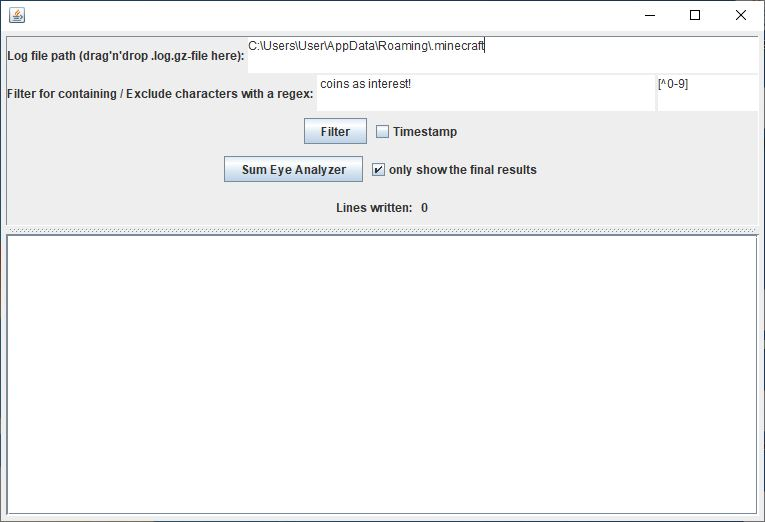

# HypixelSkyBlockChatFilter

First of all: I used the following lib https://github.com/stleary/JSON-java

This tool is made for searching for lines containing specific words or phrases in all .log.gz files ever created by Minecraft since the day you've installed it on your computer. Additionally you can use a Regex to delete certain things from these lines you've filtered. This can be useful if you e.g. only care about numbers in those lines. That is what the '[^0-9]' stands for.
The Summoning Eye / Dragon Analysis feature is especially desinged for users who play Hypixel Skyblock as well as the pre-settings which is used for showing you all the coins you've got from bank interest on Hypixel Skyblock.

